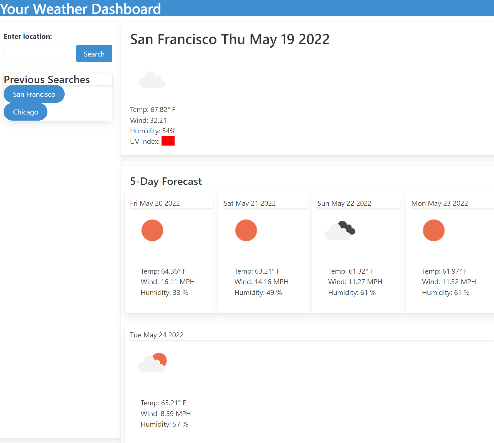

# weather-dash

## Description

Find the weather near you, or wherever you want to find it.

## Table of Contents

- [Usage](#usage)
- [Screenshots](#screenshots)
- [License](#license)
- [Contributing](#contributing)
- [Questions](#questions)

## Usage

Open the webpage at the following link: [Weather dash](srgiovanni.github.io/weather-dash/)

### Screenshots

   

## License

Copyright (c) 2022.  
Licensed under the [MIT](https://mit-license.org/) license.

---

## Contributing

You can submit pull requests for expanded functionality, bug fixes, optimization, and correcting typographical errors. Please be respectful to eachother when you meet, and strive to leave the community and code in a better state than you found it.

## Questions

If you have any questions, my <a href="https://github.com/SrGiovanni">GitHub profile</a> is linked,
or you can email me at <a href = "mailto: example@farsight.c">example@farsight.c</a>.
